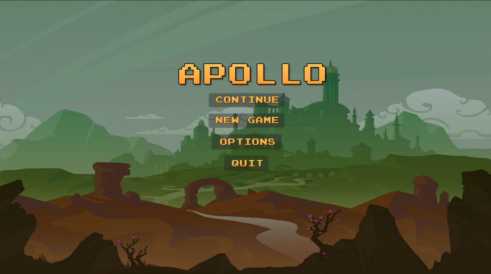

# Overview

A 2D platformer game created using Unity. 

## Features
- Main Menu
- Save & Load 
- 4 level and unique enemies, boss design
- random level generation
- leveling and skills system

## Screenshots

